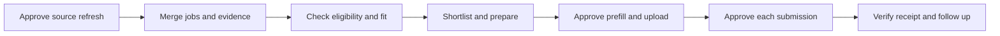

<div align="center">

# AutoApply

[English](#english) | [简体中文](#简体中文)

<a name="english"></a>

### Find internships worth applying to. Spend less time filling forms.
**Summer 2027 · AI Engineering · Software Engineering · Machine Learning**

Local job workspace · Explainable screening · Approval for every application

[Quick start](#quick-start) · [Job decisions](#job-decisions) · [Application helper](#application-helper) · [Sources and updates](#sources-and-updates)

</div>

---

AutoApply brings job sources, eligibility checks, application materials, and progress tracking into one workspace. It uses documented resume evidence to help you decide what to do next.

> **You control submission.** Exporting an application kit does not authorize an application. Prefill/upload and final submission require separate confirmations. The system does not mass-apply in the background, bypass CAPTCHAs, or automatically answer work-authorization questions.

## Workflow



## Workspace

- **Choose what to review first:** four decision shortcuts separate priority review, verification, evidence gaps, and unsuitable roles, with reasons for each job.
- **Reduce navigation:** search companies, roles, and skills; filter by track, source, evidence, or deadline; shortlist with one click before opening the details.
- **Reuse verified materials:** organize project evidence for AIE / MLE / SDE, save draft versions, and maintain reusable answers.
- **Simplify repetitive forms:** a Chrome / Edge extension reads an application kit, fills recognizable empty fields, and selects a resume.
- **Track progress:** shortlist, applications, online assessments, interviews, offers, and follow-up dates, with JSON backup/merge and CSV export.

## Job decisions

**Eligibility comes before skill scores.** Permanent full-time and new-grad positions are outside the internship scope. An internship may still require full-time working hours.

- **Priority review:** a US Summer 2027 internship with a full employer JD and no identified hard conflicts; at least three scorable requirements and 60% evidence coverage. Employer acceptance still needs verification.
- **Verify first:** missing location, season, internship type, or full JD; a source unchecked for more than 14 days; or too few scorable requirements.
- **Strengthen evidence:** scope and JD are established, but existing skill evidence has insufficient coverage.
- **Not suitable now:** an identified eligibility conflict, closed/expired role, or position clearly outside the internship scope.

The score measures **resume evidence coverage recognized by rules**, not an ATS score or hiring probability. Missing evidence does not mean missing ability. CPT, sponsorship during the internship, and future sponsorship are recorded separately; an employer's history is not a promise for the current role.

## Quick start

Requires **Node.js 22.13+, pnpm, and Python 3.10+**.

```sh
git clone https://github.com/seanpushu/AutoApply.git
cd AutoApply
pnpm install --frozen-lockfile
pnpm build
python local_service.py --open
```

The workspace runs at **http://127.0.0.1:4318/**. Use `pnpm dev` for development; Python provides the local persistence service.

Start by reviewing **My evidence**. The public repository uses demonstration data. Keep your own profile in ignored `data/`; configure resume paths in `data/resume-files.json` using `resume-en` and `resume-zh` keys. Actual resume files are not included.

## Application helper

Enable developer mode at `chrome://extensions` in Chrome or `edge://extensions` in Edge, select **Load unpacked**, and load the **extension/** folder.

1. Select jobs in **Application desk**, choose an actual PDF / DOCX resume, and export an application kit.
2. Open the extension on the employer's full application page and import the kit.
3. Approve prefill/upload, then complete remaining questions and CAPTCHAs on the original site.
4. Read the form again, review answers and attachments, and approve each submission individually.
5. Verify the success page or email, then export the receipt and import it into the workspace.

Each kit supports up to **20 jobs** and a resume of up to **3 MB**. Recognizable native **Ashby / Greenhouse / Lever** forms are supported; other layouts may require manual handling. Approval is bound to the current job and form content and expires after two minutes. Submission attempts are tracked to prevent duplicates; success is recorded only after you confirm an employer receipt.

[Detailed installation guide (Chinese)](public/application-helper-guide.html). The extension requires manual installation and does not work in the Codex in-app browser. Validation uses mock forms, not real employer applications.

## Sources and updates

Public sources include Simplify / Pitt CSC, Vansh, ApplyGuy, Greenhouse, Lever, Ashby, and selected Workday, Oracle, and SmartRecruiters job details. A locally configured Google Sheet is also connected, with **internship-only imports**. LinkedIn / Handshake provide resource links and user-initiated single-page capture, without guaranteed background account synchronization.

Source configuration lives in `config/sources.json`; the catalogue is in `public/catalog.json`. Evidence levels and verification dates are retained separately. Failed requests do not mark jobs as closed, and sparse spreadsheet rows do not overwrite existing complete facts.

Run a refresh only after your confirmation:

```sh
python scripts/refresh_jobs.py --apply
```

On the original computer, a Windows notification every three days only asks whether to refresh and does not call a model. Cloning this repository does not install a scheduled task. Prefill, rule-based matching, and public-source scripts do not call model APIs; additional research through an AI conversation consumes the applicable usage allowance.

## Data and approval boundaries

- Browser IndexedDB stores personal workspace records; the local service adds historical snapshots.
- Actual resumes, personal profiles and application history under `data/`, application kits, secrets, and environment files should not be committed to Git.
- Kits contain personal information and the complete resume. Import them only into your own helper. Selecting an attachment may upload it immediately to the employer, so uploading also requires approval.
- Records do not automatically synchronize across devices; use JSON backup and merge.
- GitHub pushes happen only when explicitly requested. Pushing code does not deploy the website; the original Sites project is tied to its owner's account.

## Validation

```sh
node --test tests/*.test.mjs
python -m unittest discover -s tests -p "test_*.py"
pnpm build
```

```text
app/                  Workspace and interactive components
lib/                  Job decisions, matching, storage, and application records
extension/            Chrome / Edge helper
config/               Source configuration and research inputs
catalogue.py          Collection, evidence merging, and deduplication
sheet_source.py       Internship imports from the selected worksheet
local_service.py      Local service and history storage
tests/                Eligibility, deduplication, storage, and approval checks
```

**Current limits:** rules cannot interpret every JD, employer forms change, and sources can become unavailable. Priority review is a suggestion to inspect a role; you decide whether to apply.

---

<div align="center">

## 简体中文

[English](#english) | [简体中文](#简体中文)

### 找到值得投的实习，把重复填写交给工具。
**Summer 2027 · AI Engineering · Software Engineering · Machine Learning**

本地岗位工作台 · 可解释筛选 · 逐份确认投递

[快速开始](#快速开始) · [岗位判断](#岗位判断) · [投递助手](#投递助手) · [来源与更新](#来源与更新)

</div>

---

AutoApply 把分散的岗位来源、资格核查、材料准备和申请记录放到同一个工作台。它围绕真实简历证据，帮助你决定下一步该做什么。

> **你掌握提交权。** 导出申请包不等于批准投递；预填上传和最终提交分别确认。系统不会后台海投、绕过验证码或自动回答工作授权问题。

## 工作流


## 工作台

- **先决定看什么**：四个快捷入口区分优先查看、先核实、先补证据和暂不适合，每个岗位展示判断原因。
- **减少来回操作**：搜索公司、岗位和技能，按方向、来源、证据或截止日期筛选；一键加入候选，再进入详情准备。
- **复用已核实材料**：按 AIE / MLE / SDE 组织项目证据，保存草稿版本和通用答案。
- **简化重复填写**：Chrome / Edge 扩展读取申请包，填写可识别的空白字段并选择简历。
- **保留求职进度**：候选、申请、OA、面试、Offer 和跟进日期；支持 JSON 备份合并与 CSV 导出。

## 岗位判断

**资格判断先于技能分数。** 正式全职与 new-grad 岗位不属于当前实习范围；实习本身可以要求全职工作时长。

- **优先查看**：美国 Summer 2027 实习、完整雇主 JD、无已识别硬冲突；至少三项可评分要求，证据覆盖达到 60%。仍须确认雇主接受情况。
- **先核实**：地点、批次、实习类型或完整 JD 缺失，来源超过 14 天未核查，或可评分要求太少。
- **先补证据**：范围与 JD 已明确，但现有技能证据覆盖不足。
- **暂不适合**：已识别资格冲突、关闭/过期或明确不在实习范围。

分数是**规则识别出的简历证据覆盖**，不是 ATS 分数或录用概率。缺少证据不等于不会这项技能。CPT、实习期间赞助和毕业后赞助分别记录，雇主历史不代表当前岗位承诺。

## 快速开始

需要 **Node.js 22.13+、pnpm、Python 3.10+**。

```sh
git clone https://github.com/seanpushu/AutoApply.git
cd AutoApply
pnpm install --frozen-lockfile
pnpm build
python local_service.py --open
```

工作台运行于 **http://127.0.0.1:4318/**。开发模式使用 `pnpm dev`；本机持久化服务由 Python 提供。

首次进入 **My evidence** 核对资料。公开仓库使用示例资料，个人资料保存在忽略的 `data/` 中。简历路径在本机 `data/resume-files.json` 中配置，使用 `resume-en` 和 `resume-zh` 键；实际简历不包含在仓库中。

## 投递助手

在 Chrome 的 `chrome://extensions` 或 Edge 的 `edge://extensions` 开启开发者模式，选择“加载已解压的扩展程序”，加载 **extension/** 文件夹。

1. 在 **Application desk** 选岗，选择实际 PDF / DOCX 简历并导出申请包。
2. 在雇主完整申请页面打开扩展，导入申请包。
3. 确认预填上传，在原站完成剩余问题与验证码。
4. 重新读取表单，审阅答案和附件，逐份确认提交。
5. 核实成功页面或邮件后，导出回执并导回工作台。

每包最多 **20 个岗位**，简历不超过 **3 MB**。支持可识别的 **Ashby / Greenhouse / Lever** 原生表单；特殊页面需手动处理。确认绑定当前岗位与表单内容，两分钟后失效。已有提交尝试防重复，只有本人确认雇主回执后才记录成功。

[详细安装说明](public/application-helper-guide.html)。扩展需要手动安装，不适用于 Codex 内置浏览器。验证使用模拟表单，未用真实公司申请测试。

## 来源与更新

公开来源包括 Simplify / Pitt CSC、Vansh、ApplyGuy、Greenhouse、Lever、Ashby，以及部分 Workday、Oracle、SmartRecruiters 职位详情。另接入本机配置的 Google Sheet，**只导入实习**。LinkedIn / Handshake 支持资源入口与本人主动单页采集，不承诺后台账户同步。

来源配置在 `config/sources.json`，目录在 `public/catalog.json`。不同证据级别与核查日期分别保留；请求失败不会据此标记岗位关闭，稀疏表格不会覆盖已有完整事实。

只在本人确认后运行更新：

```sh
python scripts/refresh_jobs.py --apply
```

原电脑每三天的 Windows 通知只提醒是否更新，不调用模型。克隆不会安装计划任务。预填、规则匹配与公开来源脚本不调用模型 API；通过 AI 对话做额外研究会消耗相应额度。

## 数据与确认边界

- 浏览器 IndexedDB 保存个人工作记录，本机服务新增历史快照。
- 实际简历、`data/` 个人资料与申请历史、申请包、密钥及环境文件不应提交到 Git。
- 申请包包含个人资料与完整简历，只导入自己的助手。选择附件可能立即上传到雇主，因此上传也须确认。
- 不自动跨设备同步记录；请使用 JSON 备份与合并。
- GitHub 推送只在用户明确要求时执行。推送代码不等于部署网站；原 Sites 项目绑定原拥有者账号。

## 验证

```sh
node --test tests/*.test.mjs
python -m unittest discover -s tests -p "test_*.py"
pnpm build
```

```text
app/                  工作台与交互组件
lib/                  岗位判断、匹配、存储与投递记录
extension/            Chrome / Edge 助手
config/               来源配置与研究输入
catalogue.py          采集、证据合并与去重
sheet_source.py       指定工作表的实习导入
local_service.py      本机服务与历史保存
tests/                资格、去重、存储与确认流程检查
```

**当前边界**：规则无法理解所有 JD，雇主表单会变化，来源会失效。优先查看是一条审阅建议，最终是否投递由你决定。

## Reusable application skill / 可复用申请技能

[Application memory skill](skills/application-memory/SKILL.md) reuses locally confirmed facts and records form-specific checks. Copy the skill folder into your local skills directory and configure a private `local-config.json` beside it with a `memoryPath` pointing to your local memory file. Start with [the empty schema](config/application-memory.example.json). Personal memory belongs in ignored `data/`, never in the repository. Final submission still requires approval for each application.

该技能复用本机已确认资料，记录地址联动、附件核查、学历补全等操作经验。将技能目录复制到本机 skills 目录后，在旁边的私密 `local-config.json` 中用 `memoryPath` 指向个人记忆文件。模板不含个人信息；每份申请仍须确认后才最终提交。
